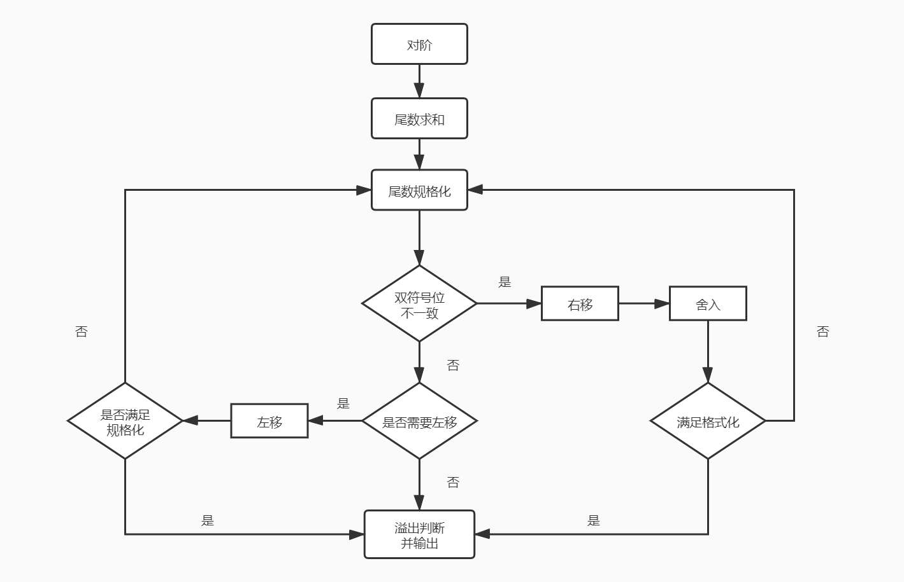

## 浮点数的加减法运算

>### 设 <i>x = Sx * rjx</i>，<i>y = Sy * rjy</i>，S 为尾数，r 为基数，j 为阶码
* 操作流程
    * 对阶 → 尾数求和 → 尾数规格化 → 舍入 → 溢出判断
* 举例
    * x = 0.1101 * 201
    * y = ( -0.1010 ) * 211
* 对阶
    * 意义：对阶的目的是是的两个浮点数阶码一致，使得尾数可以进行运算
    * 原因：
        * 浮点数的尾数运算简单
        * 浮点数位数的实际小数位与阶码有关
        * 阶码按小阶看齐大阶的原则
    * 开始对阶
        * 对阶前 x = 0.1101 * 201，y = ( -0.1010 ) * 211
    
            | 阶码符号位 | 阶码数值位 | 尾数符号位 | 尾数数值位 |
            | :---: | :---: | :---: | :---: |
            | 00 | 0001 | 00 | 1101 |
            | 00 | 0011 | 11 | 1010 |
        
        * 对阶后 x = 0.001101 * 211，y = ( -0.1010 ) * 211
        
            | 阶码符号位 | 阶码数值位 | 尾数符号位 | 尾数数值位 |
            | :---: | :---: | :---: | :---: |
            | 00 | 0011 | 00 | 1101(01) `括号内最后两位舍弃` |
            | 00 | 0011 | 11 | 1010 |
        
* 尾数求和
    * 使用补码进行运算
    * 减法运算转化为加法运算：`A - B = A + ( -B )`
    
        | 阶码符号位 | 阶码数值位 | 尾数符号位 | 尾数数值位 |
        | :---: | :---: | :---: | :---: |
        | 00 | 0011 | 00 | 1101 |
        | 00 | 0011 | 11 | 1010 |
        
        * x\[原\] = 00.0011    x\[补\] = 00.0011
        * y\[原\] = 11.1010    y\[补\] = 11.0110
        * S = ( x + y )\[补\] = 11.1001
        
            | 阶码符号位 | 阶码数值位 | 尾数符号位 | 尾数数值位 |
            | :---: | :---: | :---: | :---: |
            | 00 | 0011 | 11 | 1001 |
            
* 尾数规格化
    * 对补码进行规格化需要判断两种情况：`S > 0` 和 `S < 0`，其中
        * S\[补\] = 00.1xxxxxx (S > 0)
        * S\[补\] = 11.0xxxxxx (S < 0)
        * 如果不满足以上格式（即：`符号位与最高位不一致`），需要进行 `左移`，同时阶码相应变化，以满足格式化
            * S = ( x + y )\[补\] = 11.1001
            * S = ( x + y )\[补\] = 11.(1)0010 左移 `括号内位舍去，同时阶码 -1`

                | 阶码符号位 | 阶码数值位 | 尾数符号位 | 尾数数值位 |
                | :---: | :---: | :---: | :---: |
                | 00 | 0010 | 11 | 0010 |
                
                * S = ( x + y )\[补\] = 11.0010
                * ( x + y )\[原\] = -0.1110
                * ( x + y ) = -0.1110 x 210
    * 一般情况下都是 `左移`
    * 双符号位不一致下需要 `右移`（定点运算的溢出情况，在浮点运算中不算溢出）
        * 右移的话则需要进行 `舍入` 操作
* 舍入
    * `0 舍 1 入` 法（二进制的四舍五入）
        * 假设右移操作 S \[补\] = 10.10110111 -> S \[补\] = 11.01011011(1)
            * 此时最末位是 `1`，我们无法存储，因此进行 +1 操作 -> S \[补\] = 11.01011100 `如果有阶码，记得阶码 +1`
        * 可能溢出，如 S \[补\] = 01.11111111，双符号位不一致，需要右移 -> 00.11111111(1) -> 舍去 1 之后进行 +1 操作 -> 01.00000000 -> 再次右移 -> 00.10000000(0) -> 00.10000000 `右移两次，阶码 +2`
* 溢出判断
    * 区别
        * 定点数运算双符号位不一致为 `溢出`
        * 浮点数运算尾数双符号位不一致不算 `溢出`，因为尾数双符号位可以进行 `右移`
    * 如果规格化后，`阶码` 双符号位不一致，则认为是 `溢出`
    * 举例
        * x = 0.11010011 x 21101，y = 0.11101110 x 21100，假设阶码 4 位，尾数 8 位，计算 x + y
            * 对阶
            
                | 阶码符号位 | 阶码数值位 | 尾数符号位 | 尾数数值位 |
                | :---: | :---: | :---: | :---: |
                | 00 | 1101 | 00 | 11010011 |
                | 00 | 1100 | 00 | 11101110 |

            * 以大阶为准，y 尾数右移 1 位
            
                | 阶码符号位 | 阶码数值位 | 尾数符号位 | 尾数数值位 |
                | :---: | :---: | :---: | :---: |
                | 00 | 1101 | 00 | 11010011 |
                | 00 | 1101 | 00 | 01110111(0) |

            * 尾数求和
                * x，y 皆为正数，因此原码 = 补码
                * x + y = 00.11010011 + 00.01110111 = 01.01001010
                
                    | 阶码符号位 | 阶码数值位 | 尾数符号位 | 尾数数值位 |
                    | :---: | :---: | :---: | :---: |
                    | 00 | 1101 | 01 | 01001010 |
            
            * 尾数符号位不一致，进行规格化（右规，即右移）
                * 01.01001010 -> 右移 -> 00.10100101(0)
            * 舍入
                * 移除位为 0，舍去
                
                    | 阶码符号位 | 阶码数值位 | 尾数符号位 | 尾数数值位 |
                    | :---: | :---: | :---: | :---: |
                    | 00 | 1110 | 00 | 10100101 |
            * 溢出判断
                * 阶码符号位一致，没有溢出
            * 结果
                * x + y \[原\] = x + y \[补\] = 0.10100101 x 21110

* 总结
    
    

        
    
