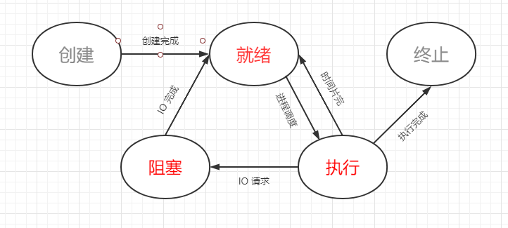

## 进程管理之五种状态模型

>### 进程的五状态模型
* `就绪`
    * 当进程备份配到除 `CPU` 以外的所有必要资源后
    * 只要在获得 `CPU` 的使用权，就可以立即运行
    * 其他资源（如进程控制块、内存堆空间、栈空间）都准备好、只差 `CPU` 资源的状态为 `就绪状态`
    * 在一个系统中多个处于就绪状态的进程通常排成一个队列
    * 就绪队列：`就绪进程1 -> 就绪进程2 -> 就绪进程3 -> 就绪进程4 -> 就绪进程5 -> ... -> 就绪进程n`
* `执行`
    * 进程获得 CPU，其程序正在执行，称为执行状态
    * 在单处理机中，在某个时刻只能有一个进程是出于执行状态
* `阻塞`
    * 进程因某种原因如：其他设备（如打印机）未就绪而无法继续执行
    * 从而放弃 CPU 的状态成为阻塞状态
    * 阻塞队列：`阻塞进程1 -> 阻塞进程2 -> 阻塞进程3 -> 阻塞进程4 -> 阻塞进程5 -> ... -> 阻塞进程n`* 创建
    * `分配 PCB` -> `插入就绪队列`
    * 不论系统或用户创建的进程，创建进程时拥有 PCB 但 `其他资源尚未就绪` 的状态成为创建状态
    * `操作系统提供 folk 函数接口创建进程`
* 终止
    * `系统清理` -> `归还 PCB`
    * 进程结束由系统清理或者归还 `PCB` 的状态成为终止状态
* 一发示意图

    

