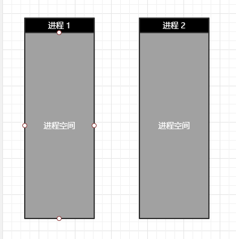
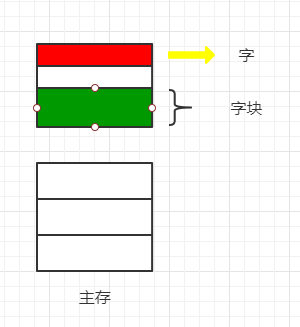
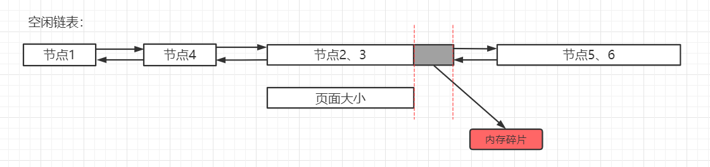
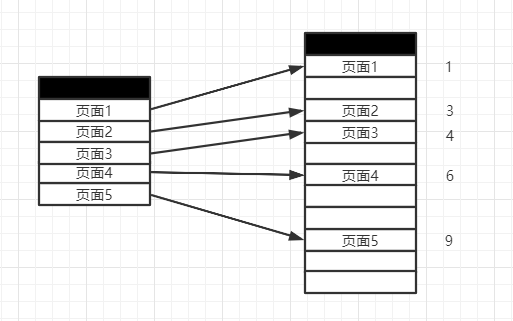
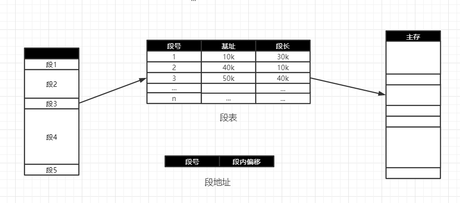
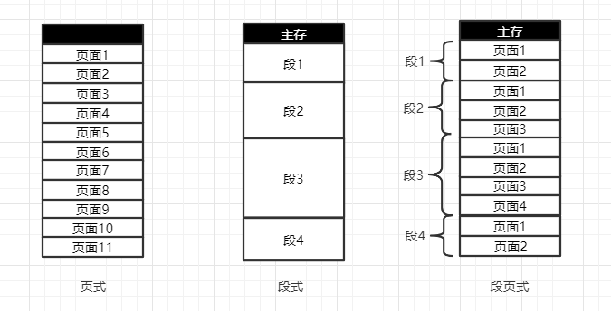

## 存储管理之段页式存储管理

>### 操作系统是如何管理进程的空间的呢？

    

>### 页式存储管理
* `字块` 是相对物理设备（内存条）的定义
* `页面` 则是相对逻辑空间的定义
* `字块` 和 `页面` 指的都是大小相等的一块内存

    

* 将进程逻辑空间等分成若干大小的页面
* 相应的把物理内存空间分成与页面大小相等的物理块
* 以页面为单位把进程空间装进物理内存中分散的物理块

    

* 页面大小应该 `适中`，`过大难以分配`，`过小内存碎片过多`
* 一般来说，页面大小通常是 `512B ~ 8K`

* 页表（记录进程逻辑空间与物理空间的映射）

    

        
    

    
    | 页表 | 字块 |
    | :---: | :---: |
    | 1 | 1 |
    | 2 | 3 |
    | 3 | 4 |
    | 4 | 6 |
    | 5 | 9 |
    
* 地址
    * 相对于字和字块，`页号` 相当于 `字块`，`页内偏移` 相当于 `字块的字内偏移`

    | 页号 | 页内偏移 |
    | :---: | :---: |
    
* 页式存储管理遇到的问题
    * 现代计算机系统中，可以支持非常大的逻辑地址空间（232 ~ 264）
    * 这样页表就会变得 `非常大`，要占用非常大的内存空间
    * 如，具有 `32位` 逻辑地址空间的分页系统，规定页面大小为 `4KB`
    * 则在每个进程页表中，页表项可达 `1M`（即 220） 个
    * 如果每个页表项占用 `1Byte`，每个 `进程仅仅页表` 就要占用 `1MB` 的内存空间
    
    * 计算一下：
        * 32 位系统进程的寻址空间为 4G
        * 4G / 4KB = 220
        
    * 解决 —— 多级页表
    
    

        
    

    
* 总结
    * 将进程逻辑空间等分成若干大小的页面
    * 相应的把物理内存空间分成与页面大小相同的物理块
    * 以页面为单位把进程空间装进物理内存中分散的物理块
    * `如果有一段连续的逻辑分布在多个页面中，将大大降低执行效率`

>### 段式存储管理
* 将进程逻辑空间划分成若干段（非等分）
* 段的长度由连续逻辑的长度决定
    * 例如，按逻辑空间分配主函数 MAIN、子程序段 X、子函数 Y 等的空间

    

        
    

* 与 `页式存储管理` 对比
    * `段式存储和页式存储都离散的管理了进程的逻辑空间`
    * 页是 `物理单位`，段是 `逻辑单位`
    * 分页是为了 `合理利用空间`，分段是 `满足用户的需求`
    * 页大小 `由硬件固定`，段长度 `可动态变化`
    * 也表信息是 `唯一的`，段表信息是 `二维的`

>### 段页式存储管理
* 分段和分页的好处
    * 页可以有效提高内存利用率
    * 分段可以更好满足用户需求（逻辑是用户编写的）
    * 两者结合，形成段页式存储管理
* 段页式存储管理主要逻辑
    * 先将逻辑空间按段式管理分成若干段
    * 再把段内空间按页式管理等分成若干页
    * 段页地址段号指的是进程的逻辑空间的具体哪一段
    * 段页地址段内页号指的是段里具体的某一页
    * 段页地址页内地址指的是某一页里面具体的字
    
    

        
    

    
    

        
    

