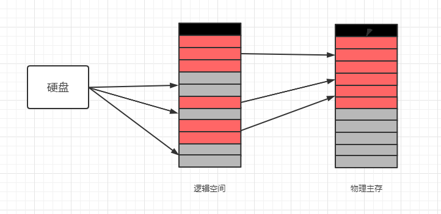
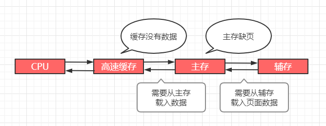

## 存储管理之虚拟内存

问题：一个游戏有 10 几个 GB，物理内存只有 4G，那这个游戏是怎么运行起来的呢？

>### 虚拟内存概述
* 为什么需要使用虚拟内存
    * 有些进程实际需要的内存很大，超过物理内存的容量
    * 多道程序设计，使得每个进程可用物理内存更加稀缺
    * 不可能无限增加物理内存，物理内存总有不够的时候
* 虚拟内存是操作系统内存管理的关键技术
* 使得多道程序运行和大程序运行成为现实
* 把程序使用内存划分，将部分暂时不使用的内存放置在辅存
* 举例：假设红色部分为程序需要使用的内存，灰色部分是暂时不需要使用的内存

    

>### 程序的局部性原理
* 局部性原理：指 `CPU` 访问存储器时，无论是 `存取指令` 还是 `存取数据`，所访问的存储单元都 `趋于聚集在一个较小的连续区域中`。
* 程序运行时，无需全部装入内存，装载部分即可
* 如果访问页不在内存，则发出缺页中断，发起页面置换
* 从用户层面看，程序拥有很大的空间，即 `虚拟内存`
* `虚拟内存实际是对物理内存的补充，速度接近于内存，成本接近于辅存`

>### 虚拟内存的置换算法
* 置换算法（与高速缓存相同）
    * 先进先出算法（FIFO）
    * 最不经常使用算法（LFU）
    * 最近最少使用算法（LRU）
* 与高速缓存的区别

    

* 替换策略分别发生在 `高速缓存 - 主存` 层次、`主存 - 辅存层次`
* `高速缓存 - 主存` 层次的替换策略主要是为了解决 `速度问题`
* `主存 - 辅存层次` 主要是为了解决 `容量问题`
