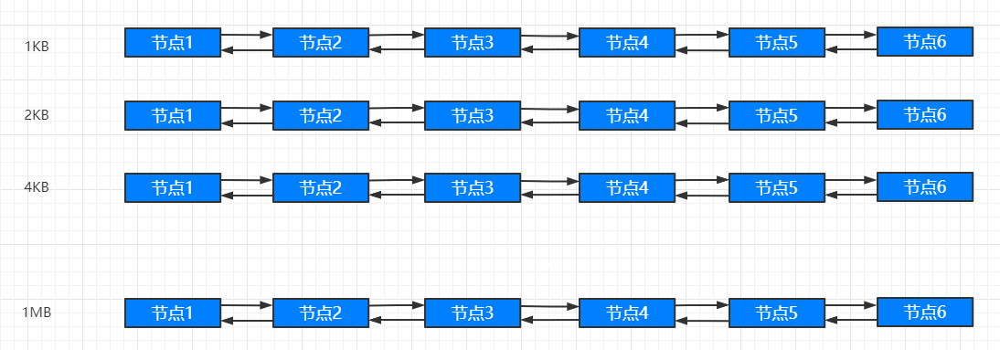
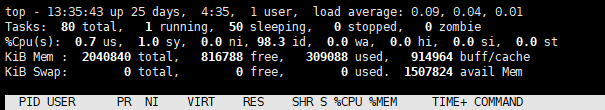

## Linux 的存储管理

>### Buddy 内存管理算法（伙伴系统）
* `页内碎片` 与 `页外碎片`
    * 内部碎片是指已经被分配出去（能明确指出属于哪个进程）的内存空间大于请求所需的内存空间，不能被利用的内存空间
    * 外部碎片是指还没有分配出去（不属于任何进程），但是由于大小而无法分配给申请内存空间的新进程的内存空闲块
* 目的
    * `努力让内存分配与相邻内存合并能快速进行`
* 内存分配原则
    * 向上取整为 2 的整数幂的大小，如
    * 70k -> 128k
    * 129k -> 256k
    * 666k -> 1024k
* 伙伴系统
    * “伙伴” 是指内存的 “伙伴”
    * 一片连续内存的 “伙伴” 是相邻的另一片大小相等的连续内存
    
    |  |
    | :---: |
    | ... | 
    | 空闲区2 | 
    | 空闲区1 | 
    |  | 
    |  | 
    
    * `空闲区 1` 与 `空闲区 2` 大小相等，互为伙伴
* 具体实现
    * 创建一系列空闲块链表，每一种都是 2 的整数次幂
    
    

        
    

    
    * 举例：假设存储空间有 1M 大小
        * 分配 100k 内存 
            * 初始化空闲块链表状态
                * 1KB -> NULL
                * 2KB -> NULL
                * 4KB -> NULL
                * ...
                * 1MB -> 1 节点
            * 100k 向上取 2 的整数次幂为 128k
            * 查询是否有 128k 空闲内存块？
            * 没有！查询是否有 256k 空闲内存块？
            * 没有！查询是否有 512k 空闲内存块？
            * 没有！查询是否有 1M 空闲内存块？
            * 有，摘下 1M 空闲内存块，分配出去，此时 1MB -> NULL
            * 拆下 512k，放在 512k 的空闲链表，其余的分配出去，此时 512k -> 1 节点
            * 拆下 256k，放在 256k 的空闲链表，其余的分配出去，此时 256k -> 1 节点
            * 拆下 128k，放在 128k 的空闲链表，其余的分配出去，此时 128k -> 1 节点
            * 分配完毕
        * 回收刚才分配的内存
            * 判断刚才分配的内存伙伴是否在空闲链表上？
            * 在！移除伙伴，合并为 256k 空闲内存，再次判断刚才分配的内存伙伴是否在空闲链表上？
            * 在！移除伙伴，合并为 512k 空闲内存，再次判断刚才分配的内存伙伴是否在空闲链表上？
            * 在！移除伙伴，合并为 1M 空闲内存，再次判断刚才分配的内存伙伴是否在空闲链表上？
            * 不在！插入 1M 空闲链表，回收完成
            * 回收后空闲块链表状态
                * 1KB -> NULL
                * 2KB -> NULL
                * 4KB -> NULL
                * ...
                * 1MB -> 1 节点
* 总结
    * 是经典的内存管理算法（实际在 Linux 系统中运行的算法）
    * 算法基于计算机处理二进制的优势，具有极高的效率
    * 算法主要是为了解决 `内存外碎片` 的问题
    * 将 `内存外碎片问题` 转化成 `内存内碎片问题`
* 

>### Linux 交换空间
* `Linux` 交换空间
    * 交换空间（Swap）是硬盘的一个分区
    * `Linux` 物理内存满时，会把一些内存交换至 Swap 空间
    * `Swap` 空间是初始化系统时配置的
* 查看 `Linux` 系统 `Swap` 空间
    * `top` 命令，如下图最后一行
    
    

        
    

    
    * 不推荐使用交换空间，因为其存储位置是磁盘，速度慢，频繁使用会导致 Linux 系统慢
* 用途
    * `冷启动内存依赖`：对于大型应用程序，在启动的过程中需要使用大量的内存，但是这些内存很多时候只在启动的时候使用一次，后续运行中很少用到，可以将这个部分保存在交换空间，释放更多的内存以便操作系统使用
    * `系统睡眠依赖`：当系统需要睡眠的时候，回把系统中所有的内存数据保存到交换空间，等系统需要启动时，再把数据重新加载到内存中，可以加快系统的启动速度
    * `大进程空间依赖`：有些进程确实需要使用很大的内存空间，但是物理内存并不够使用，需要把进程需要使用的内存暂时保存到交换空间，使其可以正常运行
* `交换空间` Vs `虚拟内存`

    | 交换空间 | 虚拟内存 |
    | :---: | :---: |
    | 存在于磁盘 |  存在于磁盘 | 
    | 与主存发生置换 | 与主存发生置换 | 
    | 是 `操作系统概念` | 是 `进程概念` | 
    | 解决 `系统物理内存不足` 的问题 | 解决 `进程物理内存不足` 的问题 | 
