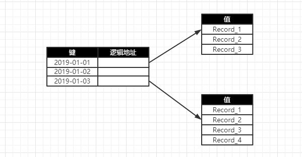
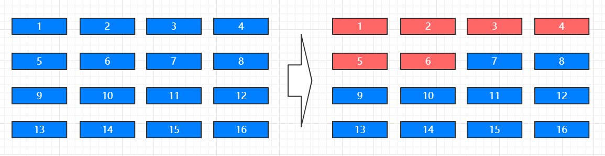
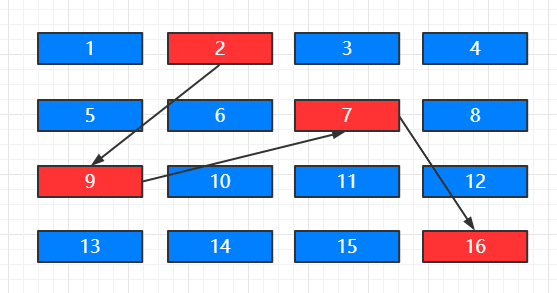
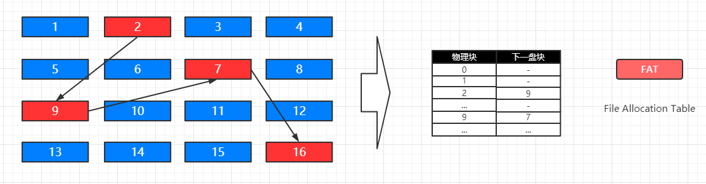
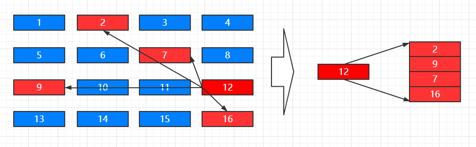
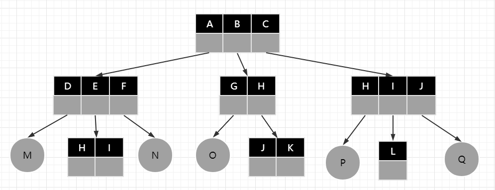

## 操作系统的文件管理

>### 文件的逻辑结构
* 逻辑结构的文件类型
    * 有结构文件
        * 包括
            * 文本文件
            * 文档（Excel，Word，PPT）
            * 多媒体文件
        * 文件内容由定长记录和可变长记录组成
        * 定长记录存储文件格式、文件描述等结构化数据项
        * 可变长记录存储文件具体内容
    * 无结构文件
        * 包括
            * 二进制文件
            * 动态、静态链接库
        * 也称为 `流式文件`
        * 文件内容长度以字节为单位
        * exe 文件，dll 文件，so 文件
    * 举例（PNG 文件）
    
        | PNG 文件标记 |
        | :---: |
        |  |
        |  |
        |  |
        | PNG 数据块 |
        |  |
        |  |
        |  |
        | 文件结束标记 |
    
* 顺序文件
    * 顺序文件是指按顺序存放在存储介质中的文件
    * 磁带的存储特性使得磁带文件只能存储顺序文件
    * 顺序文件是所有逻辑文件中存储效率最高的（只需按照顺序读写，但其增，删，改的效率低）
* 索引文件
    * 可变长文件不适合使用顺序文件格式存储
    * 索引文件是为了解决可变长文件存储而发明的一种文件格式
    * 索引文件需要配合 `索引表` 完成存储的操作
    
    

        
    

>### 辅存的存储空间分配
* 辅存的分配方式
    * 连续分配
    
    

        
    

    
        * 顺序读取文件内容非常容易，速度很快
        * 对存储要求高，要求满足容量的连续存储空间
    * 连接分配
        * 链接分配可以将文件存储在离散的盘块中
        * 需要额外的存储空间存储文件的盘块链接顺序
        * 隐式链接
        
        

            
        

        
            * 隐式分配的 `下一个链接指向` 存储在当前盘块内
            * 适合顺序访问，随机访问效率很低
            * 可靠性差，任何一个链接出问题都影响整个文件
        * 显示链接
        
        

            
        

        
            * 不支持搞笑的直接存储（FAT 记录项很多）
            * 检索时 FAT 表占用较大的存储空间（需要将整个 FAT 加载到内存）
    * 索引分配（主流系统采用的方法）
        * 把文件的所有盘集中存储（索引）
        * 读取某个文件时，将文件索引读取进内存即可
        
        

            
        

        
        * 每个文件拥有一个索引块，记录所有盘块信息
        * 索引分配方式支持直接访问盘块
        * 文件较大时，索引分配方式具有明显优势
* 存储空间管理
    * 空闲表
    
        | 序号 | 第一个空闲盘块号 | 空闲盘块数 |
        | :---: | :---: | :---: |
        | 1 | 2 | 4 |
        | 2 | 9 | 1 |
        | 3 | 11 | 32 |
        | 4 | 56 | 20 |
    
        * 空闲盘区的分配与内存分配类似
        * 首次适应算法，循环适应算法
        * 回收过程也与内存回收类似
    * 空闲链表
        * 空闲链表法把所有空闲盘区组成一个空闲链表
        * 每个链表节点存储空闲盘块和空闲的数目
    * 位示图（主要的辅存分配方式）
    
        | 盘块 / 磁道 | 1 | 2 | 3 | 4 | 5 | 6 | 7 | 8 | 9 |
        | :---: | :---: | :---: | :---: | :---: | :---: | :---: | :---: | :---: |
        | 1 | 0 | 0 | 1 | 1 | 0 | 0 | 0 | 0 | 0 |
        | 2 | 1 | 0 | 0 | 0 | 1 | 0 | 0 | 0 | 1 |
        | 3 | 0 | 1 | 0 | 1 | 0 | 0 | 0 | 1 | 1 |
        | 4 | 0 | 0 | 1 | 0 | 0 | 1 | 1 | 0 | 1 |
        | 5 | 0 | 1 | 0 | 1 | 0 | 0 | 0 | 0 | 1 |
        | 6 | 1 | 0 | 1 | 0 | 0 | 0 | 0 | 1 | 0 |
        | 7 | 0 | 0 | 0 | 1 | 1 | 1 | 1 | 1 | 0 |
    
        * 维护成本很低
        * 可以非常容易的找到空闲的盘块
        * 使用 0 / 1 比特位，占用空间很小

>### 目录管理
* 目录树

    

        
    

* 任何文件只有唯一路径
