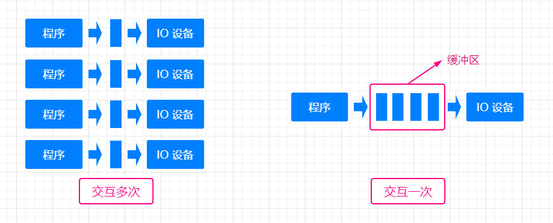

## 操作系统的设备管理

>### 广义的 IO 设备
* 广义的 IO 设备
    * `对 CPU 而言，凡是对 CPU 进行数据输入的都是输入设备`
    * `对 CPU 而言，凡是 CPU 进行数据输出的都是输出设备`
* 分类
    * 按使用特性分类
        * 存储设备
            * U 盘
            * 内存
            * 磁盘
        * 交互 IO 设备
            * 键盘
            * 鼠标
            * 显示器
    * 按信息交换的单位分类
        * 块设备（B，block 缩写）
            * 磁盘
            * SD 卡
        * 字符设备（C，char 的缩写）
            * 打印机
            * Shell 终端
    * 按设备的共享属性分类
        * 独占设备
        * 共享设备
        * 虚拟设备
    * 按传输速率分类
        * 低速设备
        * 中速设备
        * 高速设备
* 
* 

>### IO 设备的缓冲区
* `IO` 设备的缓冲区
    * `CPU 与 IO 设备的速率不匹配`
    * 减少 `CPU` 处理 `IO` 请求的频率
    * 提高 `CPU` 与 `IO` 设备之间的并行性
    
    

        
    

    
* 专用缓冲区只适用于特定的 IO 进程
* 当这样的 IO 进程比较多时，对内存的消耗也很大
* 操作系统划出可供多个进程使用的公共缓冲区，称之为缓冲池
    
    

        
    

>### SPOOLing 技术
* 是对于慢速字符设备如何与计算机主机交换信息的技术
* 利用高速共享设备，将低速的独享设备模拟为高速共享设备
* 逻辑上，系统为每一个用户都分配了一台独立的高速独享设备
* 是一种 `虚拟设备技术`

    

        
    

* `SPOOLing 技术把同步调用低速设备改为异步调用`
* 不会将设备分配给某一个进程，而是在共享设备（如磁盘）来进行输出，`SPOOLing 技术` 会在磁盘里分配存储空间，并且建立一张 IO 请求表，进程的输出数据会以文件的形式保存在 `SPOOLing` 存储空间里，各个进程的输出会形成输出队列，由 `SPOOLing` 技术进程控制设备的进程，一次将队列内的输出文件执行
* 在输入、输出之间增加了排队转储环节（输入井、输出井）
* SPOOLing 负责输入（输出）并与低速设备之间的调度
* 逻辑上，进程直接与高速设备交互，减少了进程的等待时间
