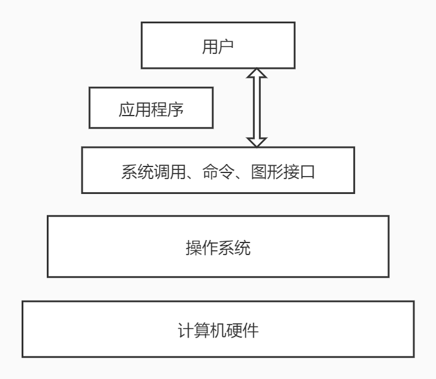

## 操作系统概览

>### What & Why
* What
    * 操作系统是管理计算机硬件和软件资源的 `计算机程序`
    * 管理配置内存、决定资源供需顺序、控制输入输出设备等
    * 操作系统提供让用户和系统交互的 `操作界面`
    * 操作系统的种类是多种多样的，不局限与计算机
    * 从手机到超级计算机，操作系统可简单也可复杂
    * 在不同的设备上，操作系统可向用户呈现多种操作手段
    * 常见的手机操作系统
        * Android
            * MIUI 小米
            * ColorOS OPPOVivo
            * Flyme 魅族
        * iOS
    * 常见的计算机操作系统
        * Windows
        * Linux
            * CentOS
            * Ubuntu
        * macOS
    * 总结
        * 操作系统是 `管理硬件、提供用户交互的软件系统`
* Why
    * 我们不可能直接操作计算机硬件
    * 计算机设备种类繁多复杂，需要统一界面，屏蔽设备之间的差异，无需关注不同设备及不同设备之间的接口
    * 操作系统的简易型使得更多人能够使用计算机，解放并发展了生产力，对人类科技提升大有帮助

>### 操作系统的基本功能
* 操作系统统一管理着计算机资源
    * 处理器资源
    * 存储器资源
    * `IO` 设备资源
    * 文件资源
* 用户无需面向硬件接口编程，如
    * `IO 设备管理软件，提供文件读写接口`
    * `文件管理软件，提供操作文件接口`
* `操作系统实现了对计算机资源的抽象`
* `操作系统提供了用户与计算机之间的接口`
    * 图像窗口模式
        * 鼠标点击、移动
    * 命令形式
        * shell 终端
    * 系统调用形式
        * 编程时的打开、关闭文件
* 来个图解

    

        
    

>### 操作系统的相关概念
* `并发性`
    * `并行` Vs `并发`
        * 并行是指两个或多个事件可以在 `同一个时刻` 发生
        * 并发是指两个或多个事件可以在 `同一个时间间隔` 发生
    * 举例
        * 并行
            * 20:00 皮神在总结《小学生都知道的计算机基础知识》
            * 20:00 大佬们在认真学习
        * 并发
            * 20:00 皮神在总结《小学生都知道的计算机基础知识》
            * 20:05 皮神喝了肥宅水
    * 联想 `多道程序设计`
        * 并发
            * 对于单处理器，在每个时刻只能有一个程序占用 `CPU`，即多道程序交替运行
            * 单处理器只存在并发的关系
        * 并行
            * 对于双处理器，在每个时刻都是有两个程序并行执行的
            * 但是对于它的每一个核心都只存在并发的关系
* 共享性
    * 共享性表现为操作系统中的资源可供多个并发的程序共同使用
    * 这种共同使用的形式称之为资源共享
    * 如，多个程序可以同时使用主存资源
    * 资源共享根据属性可分为两种方式
        * 互斥共享形式
            * 当资源被程序 A 占用时，其他程序想使用的话只能等待
            * 只有进程 A 使用完以后，其他进程才可以使用该资源
            * 例如，打印机
        * 同时访问形式
            * 某种资源在一段时间内 `并发地` 被多个程序访问
            * 这种 `同时` 是宏观的，宏观上去看该资源可以被同时访问
            * 例如，硬盘
* 虚拟性
    * 虚拟性表现为把一个 `物理实体` 转变为若干个 `逻辑实体`
    * 物理实体是真实存在的，逻辑实体是虚拟的
    * 虚拟的技术主要有 `时分复用技术` 和 `空分复用技术`
        * 时分复用技术
            * 资源在时间上进行复用，不同程序 `并发` 使用
            * 多道程序分时使用计算机的硬件资源
            * 提高资源利用率
            * 举例
                * 虚拟处理器技术
                    * 借助多道程序设计技术
                    * 为每个程序建立进程
                    * 多个程序分时复用处理器
                * 虚拟设备技术
                    * 物理设备虚拟为多个逻辑设备
                    * 每个程序占用一个逻辑设备
                    * 多个程序通过逻辑设备并发访问
        * 空分复用技术
            * 空分复用技术用来实现虚拟磁盘、虚拟内存等
            * 提高资源的利用率，提升编程效率
            * 扩展
                * 虚拟磁盘技术
                    * 物理磁盘虚拟为逻辑磁盘
                    * C、D、E 等逻辑盘
                    * 使用起来更加安全、方便
                * 虚拟内存技术
                    * 在逻辑上扩大程序的存储容量
                    * 使用比实际内存更大的容量
                    * 大大提升编程效率
* 异步性
    * 在多道程序环境下，允许多个进程并发执行
    * 进程在使用资源时可能需要等待或放弃
    * 进程的执行并不是一气呵成的，而是以走走停停的形式推进（以资源为例，假设进程执行到某一时刻需要使用某一个资源，如果该资源正在被使用，则进程会停止或等待这个资源被释放后，再获取该资源在进行下去，此为走走停停）
    * 进程是以不可预知的速度向前推进的，我们不知道程序 `何时执行`、`何时暂停`、`何时完成`，这些不可预知的事情导致了 `异步性`
