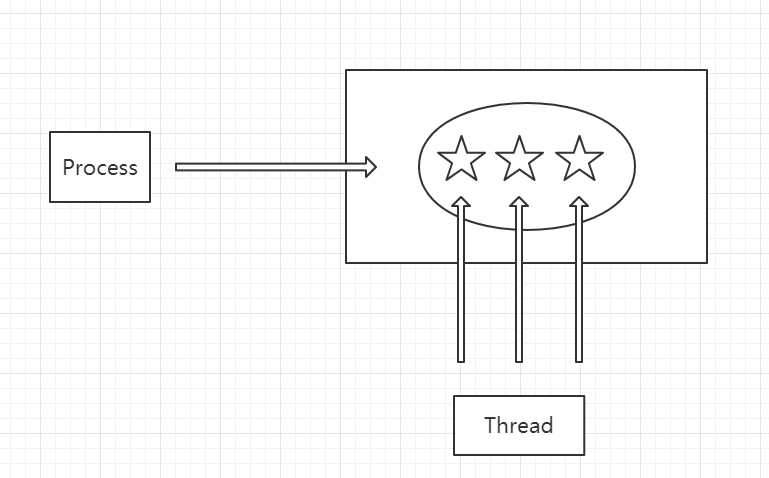

## 进程管理之进程实体

>### 为什么需要进程
* 现象
    * 在没有配置 `OS` 之前，资源属于当前运行的程序
    * 配置 `OS` 之后，引入 `多道程序设计` 的概念
    * 合理的隔离资源、运行环境提升资源利用率
* 为什么需要进程
    * 进程是系统进行资源分配和调度的基本单位
    * 进程作为程序独立运行的载体，保障程序正常执行
    * 进程的存在是的操作系统资源的利用率大幅提升

>### 进程的实体
* 主存中的进程形态
    * 进程是主存中的一段连续存储的空间，称为 `进程控制块`
    * 进程控制块（PCB）
        * 包括
        
            | 标识符 |
            | :---: |
            | 状态 |
            | 优先级 |
            | 程序计数器 |
            | 内存指针 |
            | 上下文数据 |
            | `IO` 状态信息 |
            | 记账信息 |
            | ... |
    
            * 标识符
                * 标识符唯一标记一个进程，用于区别其他进程
            * 状态
                * 标记进程的进程状态，如：运行态、阻塞状态
            * 程序计数器
                * 指向进程即将被执行的下一条指令的地址
            * 内存指针
                * 程序代码、进程数据相关指针
                * 可能有多个，分别指向程序具体的逻辑代码或指向进程数据相关的地址
            * 上下文数据
                * `进程执行时处理器存储的数据`
            * `IO` 状态信息
                * 被进程 `IO` 所占用的文件列表
            * 记账信息
                * 进程使用处理器时间、时钟数总和等
        * 按分类可以分为
            * 进程标识符
            * 处理机状态
            * 进程调度信息
            * 进程控制信息
    * 进程的实体 —— 进程控制块（PCB）
        * 是用于描述和控制进程运行的通用数据结构
        * 记录进程当前状态和控制进程运行的全部信息
        * 使得进程能成为够独立运行的基本单位，每个进程都依赖于进程控制块被操作系统调用或被控制
        * `PCB` 是操作系统进行调度时经常被读取的信息
        * `PCB` 是常驻内存的，存放在系统专门开辟的 `PCB` 区域内
* 进程与线程
    
    

        
    

    
    * 进程（Process）与线程（Thread）是一对多的关系，一个进程可以拥有多个线程
    * 进程是系统进行资源分配和调度的基本单位
    * 线程是操作系统进行运行调度的最小单位
    * 操作系统对进程的调度实际上是对线程的调度
    * 线程包含在进程之中，是进程中实际运行的工作单位（而不是线程）
    * 一个进程可以并发多个线程，每个线程执行不同的任务
    * `线程共享进程的资源`
    * 来个对比，明确一下
    
        | | 进程 | 线程 |
        | :---: | :---: | :---: |
        | 资源 | 资源分配的基本单位 | 不拥有资源 |
        | 调度 | 独立调度的基本单位 | 独立调度的最小单位 |
        | 系统开销 | 进程系统开销大 | 线程系统开销小 |
        | 通信 | 进程 IPC（后续学习） | 读写同一进程数据通信 |
