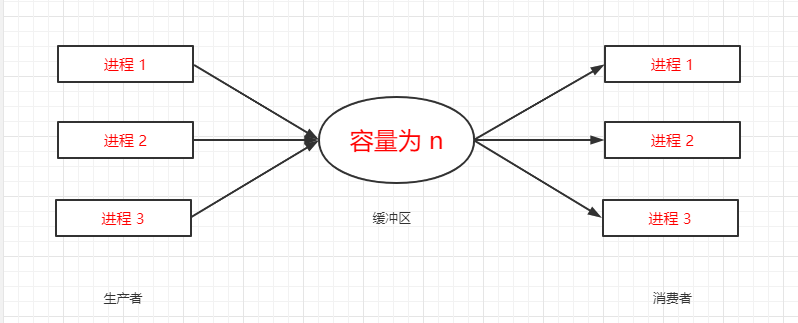

## 进程管理之进程同步

>### 进程间的同步
* 为什么需要进程间同步
    * 例子：生产者 —— 消费者问题
        * 有一群生产者进程在生产产品，并将这些产品提供给消费者进程进行消费，生产者进程和消费者进程可以并发执行在两者之间设置了一个容量为 n 的可缓冲区缓冲池，生产者进程需要将所生产的产品放到一个可缓冲区中，消费者进程可以从缓冲区取走产品消费。
       
        

            
        

        
        * 生产者往缓冲区 +1
        * 消费者往缓冲区 -1
        * 此模型在生活中没有问题
        * 但是在计算机里，缓冲是在主存或者高速缓存上面的，操作缓冲需要三个步骤
            * 先把缓冲的数据取出来，放到计算机的寄存器中，即 `register = count`
            * 生产一个产品，`register += 1`
            * 将 register 放回缓冲区，`count = register`
        * 上述场景单从生产者程序或者消费者程序的角度去看是没有问题的
        * 当两者 `并发` 执行时就可能出差错
    * 例子：哲学家进餐问题
        * 有五个哲学家，他们的生活方式是交替的进行思考和进餐，哲学家们共同使用一张圆桌，分别坐在周围的五张椅子上，在圆桌上有五个碗和五支筷子。平时哲学家们只进行思考，饥饿时则试图取靠近他们的左、右两只筷子，只有两者筷子都被他们拿到的时候才能进餐，进餐完毕之后，放下左右筷子继续思考。
        * 可能的执行顺序：拿起左边筷子 -> 拿起右边筷子 -> 进餐
        * 可能遇到的情况：拿起左边筷子 -> 发现右边筷子被拿了-> 等待右边筷子被释放 -> 拿起右边筷子 -> 进餐
        * 极端情况：五个哲学家同时拿起左边筷子 -> 发现右边筷子被拿了-> 五个哲学家同时等待右边筷子被释放 -> 相互等待 -> 五个哲学家饿死
    * 以上例子的根源问题：彼此相互之间没有通信，下面情况可能会避免这个问题
        * “如果生产者通知消费者：我已经完成了一件生产”
        * “如果哲学家向旁边的哲学家说：我要进餐了”
    * 进程间同步的根源需求
        * `对竞争资源在多进程间进行使用次序的协调`
        * `使得并发执行的多个进程之间可以有效使用资源和相互合作`
* 进程间同步的原则
    * `临界资源`
        * 临界资源是指一些虽作为共享资源却又无法同时被多个线程共同访问的共享资源。
        * 当有进程在使用临界资源时，其他进程必须根据操作系统的同步机制，等待占用进程释放该共享资源，才可重新竞争使用共享资源
    * 原则
        * 空闲让进：资源无占用，允许使用
        * 忙则等待：资源有占用，请求进程等待
        * 有限等待：保证在有限的等待时间能够使用资源
        * 让权等待：等待时，进程需要让出 `CPU`（进程从运行状态进入阻塞状态，以保证 `CPU` 可以高效利用）
    * 进程间同步的方法
        * 消息队列
        * 共享存储
        * 信号量
* 线程同步
    * 进程间线程共享进程资源，当多个线程并发使用进程资源时，也会发生上述例子的情况，因此进程内多线程也需要同步
    * 线程同步的方法
        * 互斥量
        * 读写锁（避免多写少读、多读少写）
        * 自旋锁
        * 条件变量
