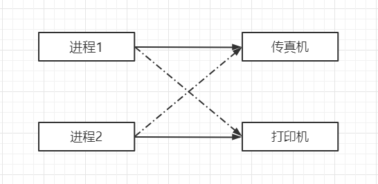
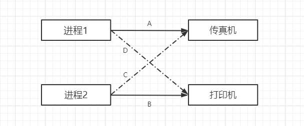
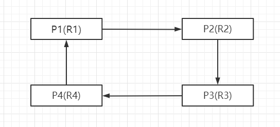

## 作业管理之死锁

>### 死锁
* 死锁是指两个或两个以上的进程在执行过程中，由于竞争资源或者由于彼此通信而造成的一种阻塞现象，若无外力作用，他们都将无法推进下去。
* 此时称 `系统处于死锁状态` 或者 `系统产生了死锁`，这些永远在互相等待的进程称为死锁进程。
* 例如：五个哲学家进餐问题

>### 死锁的产生
* 竞争资源
    * 共享资源数量不满足各个进程需求
    
        

            
        

    
        * 等待请求的资源被释放
        * 自身占用的资源不释放
* 进程调度顺序不当
    * 各个进程之间发生资源竞争导致死锁
    
        

            
        

        
        * 按照 `A -> B -> C -> D` 的顺序就会引起死锁的产生
        * 按照 `A -> D -> B -> C` 就可以避免死锁的产生
* 死锁的四个必要条件（同时满足才会导致死锁）
    * 互斥条件
        * 进程对资源的使用是 `排他性的使用`
        * 某资源只能由一个进程使用，其他进程需要使用只能等待
    * 请求保持条件
        * 进程至少保持一个资源，又提出新的资源请求
        * 新资源被占用，请求被阻塞
        * 被阻塞的进程不释放自己保持的资源
    * 不可剥夺条件
        * 进程获得的资源在未完成使用前不能被剥夺
        * 获得的资源只能由进程自身释放
    * 环路等待条件
        * 发生死锁时，必然存在进程 - 资源环形链
        
        

            
        

        
>### 死锁的处理
* 预防死锁的方法
    * 只要 `破坏一个或多个死锁的必要条件`，就可以预防死锁
        * 摒弃请求保持条件
            * 系统规定进程运行之前，一次性申请所有需要的资源
            * 进程在运行期间不会提出资源请求，从而摒弃请求保持条件
        * 摒弃不可剥夺条件
            * 当一个进程请求新的资源得不到满足时，必须释放所有的资源
            * 进程运行时占有的资源可以被释放，意味着可以被剥夺
        * 摒弃环路等待条件
            * 可用资源线性排序，申请必须按照需要递增申请
            * 线性申请不再形成坏路，从而摒弃了环路等待条件
            * 假设资源顺序为 `A -> B -> C -> D -> E`，那么
                * 要想使用资源 `D`，必须先申请资源 `A`
                * 要想使用资源 `B`、`C`、`E`，必须先申请资源 `B`，再申请 `C`，再申请 `E`
* 银行家算法
    * 是一个可操作的著名的避免死锁的算法
    * 以银行借贷系统分配策略为基础的算法
    * 客户申请的贷款是有限的，每次申请需声明最大资金量
    * 银行间在能够满足贷款时，都应该给客户贷款
    * 客户在使用贷款后，能够及时归还贷款
    
        * 已分配资源表
        
        | | A | B | C | D |
        | :---: | :---: | :---: | :---: | :---: |
        | P1 | 0 | 0 | 1 | 4 |
        | P2 | 1 | 4 | 3 | 2 |
        | P3 | 1 | 3 | 5 | 4 |
        | P4 | 1 | 0 | 0 | 0 |
        
        * 所需资源表
        
        | | A | B | C | D |
        | :---: | :---: | :---: | :---: | :---: |
        | P1 | 0 | 6 | 5 | 6 |
        | P2 | 1 | 9 | 4 | 2 |
        | P3 | 1 | 3 | 5 | 6 |
        | P4 | 1 | 7 | 5 | 0 |
      
        * 可分配资源表
        
        | A | B | C | D |
        | :---: | :---: | :---: | :---: |
        | 1 | 5 | 2 | 0 | 4 |
    
        * 还需分配资源表
        
        | | A | B | C | D |
        | :---: | :---: | :---: | :---: | :---: |
        | P1 | 0 | 6 | 4 | 2 |
        | P2 | 0 | 5 | 1 | 0 |
        | P3 | 0 | 0 | 0 | 2 |
        | P4 | 0 | 7 | 5 | 0 |
        
    * 使用 `所需资源表` 减去 `已分配资源表` 得到 `还需分配资源表`
    * 将 `可分配资源表` 分别分配给其他进程，发现只有 P2 可以运行，其他进程均缺少资源
    * 先将可分配资源分配给 `P2`，待 `P2` 运行结束后，释放所需资源，再计算哪个进程可以在获得 `可分配资源表` 的资源后可以运行
