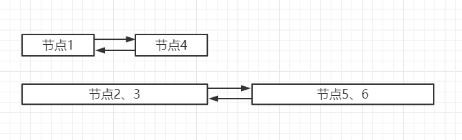

## 存储管理之内存分配与回收

>### 内存分配与回收的意义
* `早期计算机编程并不需要过多的存储管理`
* `随着计算机和程序越来越复杂，存储管理成为必要`
* 确保计算机有足够的内存处理数据
* 确保计算机可以从内存中获取一部分内存使用
* 确保程序可以归还使用后的内存以供其他程序使用

>### 内存分配的过程
* 单一连续分配
    * 将内存分为系统区和用户区，系统区的内存给操作系统使用，用户区给用户程序使用
    * 是最简单的内存分配方式
    * 只能在单用户、单进程的操作系统中使用
    
    | 主存 |
    | :---: |
    ||
    | 系统区 |
    ||
    ||
    ||
    | 用户区 |
    ||
    ||
    ||
    ||
    ||
    ||
        
* 固定分区分配
    * 固定分区分配是支持多道程序的最简单的存储分配方式
    * 内存空间被划分为若干固定大小的区域
    * 每个分区只提供给一个程序使用，互不干扰
    
    | 主存 |
    | :---: |
    | 分区1 |
    | 分区2 |
    | 分区3 |
    | 分区4 |
    | 分区5 |
    | 分区6 |
    | 分区7 |
    | 分区8 |
    | 分区9 |
    | ... |
    | 分区N |
    
* 动态分区分配
* 根据进程实际需要，动态分配内存空间
* 需要设计相关数据结构、算法
    
    | 主存 |
    | :---: |
    | 空闲区1 |
    ||
    | 空闲区2 |
    | 空闲区3 |
    ||
    | 空闲区4 |
    ||
    ||
    | 空闲区5 |
    | 空闲区6 |
    ||
    
    * 动态分区空闲表数据结构

    | 分区 | 1 | 2 | 3 | 4 | 5 | 6 | 7 | 8 | 9 | 10 | 11 |
    | :---: | :---: | :---: | :---: | :---: | :---: | :---: | :---: | :---: | :---: | :---: | :---: |
    | 标记 | 0 | 1 | 0 | 0 | 1 | 1 | 0 | 0 | 1 | 1 | 0 |
    
    * 动态分区空闲链数据结构（双向链表），连续空间可以合并，以减少空闲链表的节点数，由下图表示
       * 每个节点需记录可存储的容量
 
        

            
        

    
    * 动态分区分配算法
        * 首次适应算法（FF 算法）
            * 分配内存时从开始位置顺序查找适合的内存区（使用空闲链）
            * 若没有合适的空闲区，则该次分配失败
            * 每次均从头部开始，使得头部地址空间不断被划分，如果头部的地址被分配多次后，剩余空间减小，每次分配新空间是需要遍历很多碎片，直到分配完成
            * 为了改进，出现了 `循环适应算法`，每次不从头不开始分配，而是选择从上一次检索结束的位置开始
        * 最佳适应算法（BF 算法）
            * 要求空闲区链表按照容量大小排序
            * 遍历空闲区链表找到最佳大小的空闲区（避免大材小用）
            
            

                
            

            
        * 快速适应算法（QF 算法）
            * 要求有多个空闲区链表
            * 每个空闲区链表存储一种容量的空闲区

            

                
            

>### 内存回收的过程
* 场景一：空闲区和回收区连接在一起，回收区位于空闲区后面

    | 主存 |
    | :---: |
    | ... |
    ||
    | 空闲区1 |
    | 回收区 |
    | ... |
    | ... |

    * 不需要新建空闲链表节点
    * 只需要把 `空闲区 1` 的容量增大为空闲区即可
* 场景二：空闲区和回收区连接在一起，回收区位于空闲区前面

    | 主存 |
    | :---: |
    | ... |
    ||
    | 回收区 |
    | 空闲区1 |
    | ... |
    | ... |

    * 将回收区与空闲区合并
    * 新的空闲区使用回收区的地址
* 场景三：回收区位于两块空闲区之间

    | 主存 |
    | :---: |
    | ... |
    ||
    | 空闲区1 |
    | 回收区 |
    | 空闲区2 |
    | ... |
    | ... |

    * 将 `空闲区1`、`空闲区2` 和 `回收区` 合并
    * 新的空闲区使用 `空闲区 1` 的地址
* 场景四：单一回收区

    | 主存 |
    | :---: |
    | ... |
    ||
    | 回收区 |
    | ... |
    | ... |

* 为回收区创建新的空闲节点
* 插入到相应的空闲区链表中
 