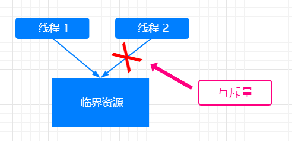

## 线程同步之互斥量

>### 互斥量的工作原理

<div align="center">
    
</div>

* 互斥量的工作原理
    * 假设线程 1 和线程 2 分别有三条指令
    * 引发线程同步的根本原因是 `线程 1 和线程 2 的指令是交叉执行的`
    * 互斥量可以保证这两个进程先后执行
        * 即：先执行线程 1 的三条指令，再执行线程 2 的三条指令，或者相反：先执行线程 2 的三条指令，后执行线程 1 的三条指令
        * 实质是保证了这些关键指令的 `原子性`
        * `原子性` 是指一系列操作 `不可被中断` 的特性
        * 这一系列操作 `要么全部执行完成，要么全部没有执行`
        * 不存在 `部分执行，部分未执行` 的情况
    * 互斥量是最简单的线程同步方法
    * 互斥量（互斥锁），有且仅有两个状态：`加锁` 和 `解锁`
    * 两个状态可以保证资源访问的串行，如果一个线程正在使用加锁的资源，其他线程 `必须等待这一线程使用完毕后，释放该资源并解锁`，才能继续使用该资源
* 互斥量的例子
    * 假设有如下 `C++` 代码
        
        ```C++
            #include <stdio.h>
            #include <stdlib.h>
            #include <unistd.h>
            #include <pthread.h>
            #include <vector>
            
            // 临界资源
            int num = 0;
            
            // 生产者
            void *producer(void*) {
                int times = 100000000;
                while(times--) {
                    num += 1;
                }
            }
            
            // 消费者
            void *comsumer(void*) {
                int times = 100000000;
                while(times--) {
                    num -= 1;
                }
            }
            
            
            int main() {
                printf("Start in main function.");
                pthread_t thread1, thread2;
                pthread_create(&thread1, NULL, &producer, NULL);
                pthread_create(&thread2, NULL, &comsumer, NULL);
                pthread_join(thread1, NULL);
                pthread_join(thread2, NULL);
                printf("Print in main function: num = %d\n", num);
                return 0;
            }
        ```
        
    * 编译以上 `C++` 代码后，发现虽然生产者和消费者循环的次数相等，但是 `最后的 num 并不为 0`，是因为存在线程同步的问题
    * 改进上面代码，为
    
        ```C++
            #include <stdio.h>
            #include <stdlib.h>
            #include <unistd.h>
            #include <pthread.h>
            #include <vector>
            
            // 初始化互斥量  
            pthread_mutex_t mutex = PTHREAD_MUTEX_INITIALIZER;
            
            // 临界资源
            int num = 0;
            
            // 生产者
            void *producer(void*) {
                int times = 100000000;
                while(times--) {
                    // 加锁
                    pthread_mutex_lock(&mutex);
                    num += 1;
                    // 解锁
                    pthread_mutex_unlock(&mutex);
                }
            }
            
            // 消费者
            void *comsumer(void*) {
                int times = 100000000;
                while(times--) {
                    // 加锁
                    pthread_mutex_lock(&mutex);
                    num -= 1;
                    // 解锁
                    pthread_mutex_unlock(&mutex);
                }
            }
            
            
            int main() {
                printf("Start in main function.");
                pthread_t thread1, thread2;
                pthread_create(&thread1, NULL, &producer, NULL);
                pthread_create(&thread2, NULL, &comsumer, NULL);
                pthread_join(thread1, NULL);
                pthread_join(thread2, NULL);
                printf("Print in main function: num = %d\n", num);
                return 0;
            }
        ```
    
    * 此时编译代码多次执行后，发现 `num 始终为 0`，说明加锁和解锁操作有效
    * 但是，程序的执行时间会变长，是由于加锁解锁会 `带来性能的损耗`
