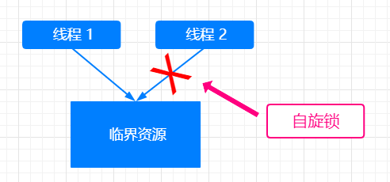

## 线程同步之自旋锁

>### 自旋锁的工作原理

<div align="center">
    
</div>

* `自旋锁`
    * `自旋锁` 也是一种多线程同步的变量
    * 使用 `自旋锁` 的线程会反复检查锁变量是否可用
    * `自旋锁` 不会让出 `CPU`，是一种 `忙等待` 状态
    * `自旋锁` 的本质是 `死循环等待锁被释放`
* 优点
    * 自旋锁避免了 `进程或线程上下文切换的开销`，如果所占用的时间不长，使用自旋锁的代价也是非常小的
    * 操作系统内部大多使用 `自旋锁` 而非 `互斥锁`
    * 自旋锁不适合在单核 `CPU` 使用，因为自旋锁在等待的时候并不会释放 `CPU`，而是 `死循环` 的去等待，会导致其他的进程或线程无法执行
* 例子
    * 假设有如下 `C++` 代码
    
        ```C++
            #include <stdio.h>
            #include <stdlib.h>
            #include <unistd.h>
            #include <pthread.h>
            #include <vector>
            
            // 定义自旋锁
            pthread_spinlock_t spin_lock;
            
            int num = 0;
            
            void *producer(void*) {
                int times = 10000000;
                while(times--) {
                    pthread_spin_lock(&spin_lock);
                    num += 1;
                    pthread_spin_unlock(&spin_lock);
                }
            }
            
            void *comsumer(void*) {
                int times = 10000000;
                while(times--) {
                    pthread_spin_lock(&spin_lock);
                    num -= 1;
                    pthread_spin_unlock(&spin_lock);
                }
            }
            
            int main(){
                printf("Start in main function.\n");
                pthread_spin_init(&spin_lock, 0);
                pthread_t thread1, thread2;
                pthread_create(&thread1, NULL, &producer, NULL);
                pthread_create(&thread2, NULL, &comsumer, NULL);
                pthread_join(thread1, NULL);
                pthread_join(thread2, NULL);
                printf("Print in main function: num = %d\n", num);
                return 0;
            }
        ```

    * 验证自旋锁是否会让出 `CPU`
        * 让消费者每次执行等待 10s，查看 `CPU` 占用是否为 `100%`
        * 改进以上代码，为
            
            ```C++
                #include <stdio.h>
                #include <stdlib.h>
                #include <unistd.h>
                #include <pthread.h>
                #include <vector>
                
                // 定义自旋锁
                pthread_spinlock_t spin_lock;
                
                int num = 0;
                
                void *producer(void*) {
                    int times = 10000000;
                    while(times--) {
                        pthread_spin_lock(&spin_lock);
                        num += 1;
                        pthread_spin_unlock(&spin_lock);
                    }
                }
                
                void *comsumer(void*) {
                    int times = 10000000;
                    while(times--) {
                        pthread_spin_lock(&spin_lock);
                        num -= 1;
                        // 模拟消费者执行的时间很长
                        sleep(10);
                        pthread_spin_unlock(&spin_lock);
                    }
                }
                
                
                int main(){
                    printf("Start in main function.\n");
                    pthread_spin_init(&spin_lock, 0);
                    pthread_t thread1, thread2;
                    pthread_create(&thread1, NULL, &producer, NULL);
                    pthread_create(&thread2, NULL, &comsumer, NULL);
                    pthread_join(thread1, NULL);
                    pthread_join(thread2, NULL);
                    printf("Print in main function: num = %d\n", num);
                    return 0;
                }
            ```
          
        * 以后台进程的是形式执行该程序，使用 `top` 命令查看 `CPU` 占用率为 99%+，得出自旋锁不会让出 `CPU`
