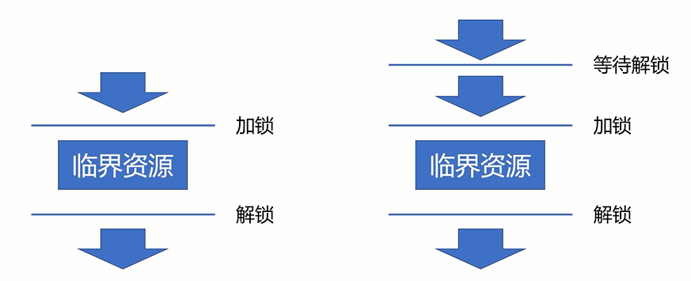
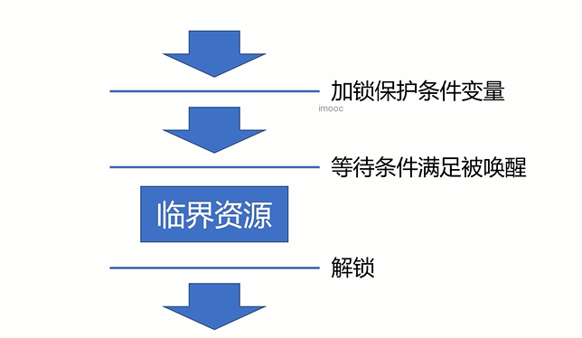

## 线程同步方法总结

>### 互斥量、自旋锁、读写锁

    

>### 条件变量

    

>### 线程同步方法对比
| 同步方法 | 描述 |
| :---: | :---: |
| 互斥锁 | `最简单` 的一种线程同步方法，会 `阻塞线程` |
| 自旋锁 | `避免切换` 的一种线程同步方法，属于 `忙等待` |
| 读写锁 | 为 `读多写少` 的资源设计的线程同步方法，可以 `显著提高性能` |
| 条件变量 | 相对复杂的一种线程同步方法，有 `更灵活的使用场景` |
