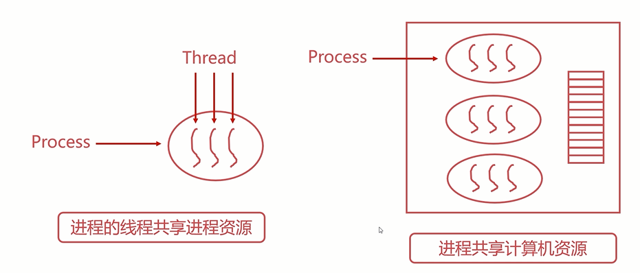
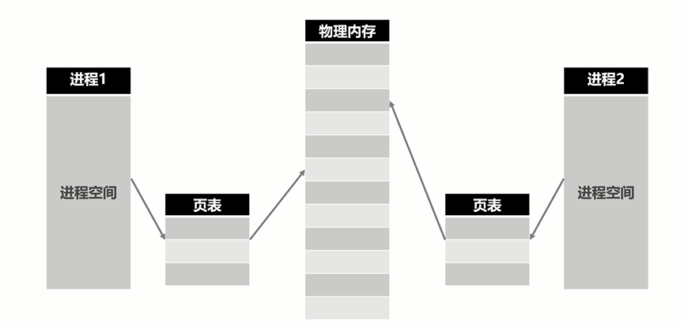
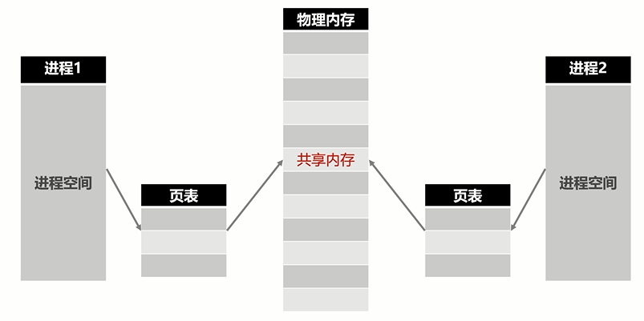
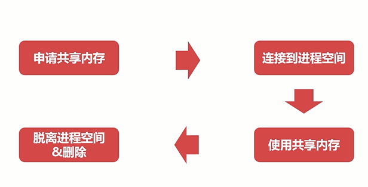

## 进程同步之共享内存

>### 回顾
* 进程与线程分别是如何共享资源的

    <div align="center">
        
    </div>

* 操作系统的进程管理

    <div align="center">
        
    </div>

* 在某种程度上，多进程是共通使用物理内存的
* 由于操作系统的进程管理，进程间的内存空间是独立的，即 `进程默认是不能访问进程空间之外的内存空间的`

>### 进程同步之共享内存

<div align="center">
    
</div>

* 共享内存允许不相关的进程访问同一片物理内存
* 共享内存是两个进程之间共享和传递数据最快的方式
* 共享内存 `未提供同步机制`，需要借助其他机制管理访问
* 共享内存是高性能后台开发中最常用的进程同步方式

>### 使用共享内存的方法步骤

<div align="center">
    
</div>

* 共享内存的例子，假设有如下 `C++` 代码

    <div align="center">
        
    </div>

    * common.h
    
        ```C++
            #ifndef __COMMON_H__
            #define __COMMON_H__
            
            #define TEXT_LEN 2048
            
            // 共享内存的数据结构
            struct ShmEntry{
                // 是否可以读取共享内存，用于进程间同步
                bool can_read;
                // 共享内存信息
                char msg[2048]; 
            };
            
            #endif
        ```
    * server.cpp
        
        ```C++
            #include "common.h"

            #include <sys/shm.h>
            #include <stdlib.h>
            #include <unistd.h>
            #include <stdio.h>
            #include <string.h>
            
            #include <iostream>
            
            int main()
            {
                // 共享内存的结构体
                struct ShmEntry *entry;
            
                // 1. 申请共享内存
                int shmid = shmget((key_t)1111, sizeof(struct ShmEntry), 0666|IPC_CREAT);
                if (shmid == -1){
                    std::cout << "Create share memory error!" << std::endl;
                    return -1;
                }
            
                // 2. 连接到当前进程空间/使用共享内存
                entry = (ShmEntry*)shmat(shmid, 0, 0);
                entry->can_read = 0;
                while (true){
                    if (entry->can_read == 1){
                        std::cout << "Received message: " << entry->msg << std::endl;
                        entry->can_read = 0;
                    }else{
                        std::cout << "Entry can not read. Sleep 1s." << std::endl;
                        sleep(1);
                    }
                }
                // 3. 脱离进程空间
                shmdt(entry);
            
                // 4. 删除共享内存 
                shmctl(shmid, IPC_RMID, 0);
            
                return 0;
            }
        ```
    * client.cpp
    
        ```C++
            #include "common.h"

            #include <sys/shm.h>
            #include <stdlib.h>
            #include <unistd.h>
            #include <stdio.h>
            #include <string.h>
            
            #include <iostream>
            
            int main()
            {
                struct ShmEntry *entry;
            
                // 1. 申请共享内存
                int shmid = shmget((key_t)1111, sizeof(struct ShmEntry), 0666|IPC_CREAT);
                if (shmid == -1){
                    std::cout << "Create share memory error!" << std::endl;
                    return -1;
                }
            
                // 2. 连接到当前进程空间/使用共享内存
                entry = (ShmEntry*)shmat(shmid, 0, 0);
                entry->can_read = 0;
                char buffer[TEXT_LEN];
                while (true){
                    if (entry->can_read == 0){
                        std::cout << "Input message>>> ";
                        fgets(buffer, TEXT_LEN, stdin);
                        strncpy(entry->msg, buffer, TEXT_LEN);
                        std::cout << "Send message: " << entry->msg << std::endl;
                        entry->can_read = 1;
                    }
                }
                // 3. 脱离进程空间
                shmdt(entry);
            
                // 4. 删除共享内存 
                shmctl(shmid, IPC_RMID, 0);
            
                return 0;
            }
        ```
