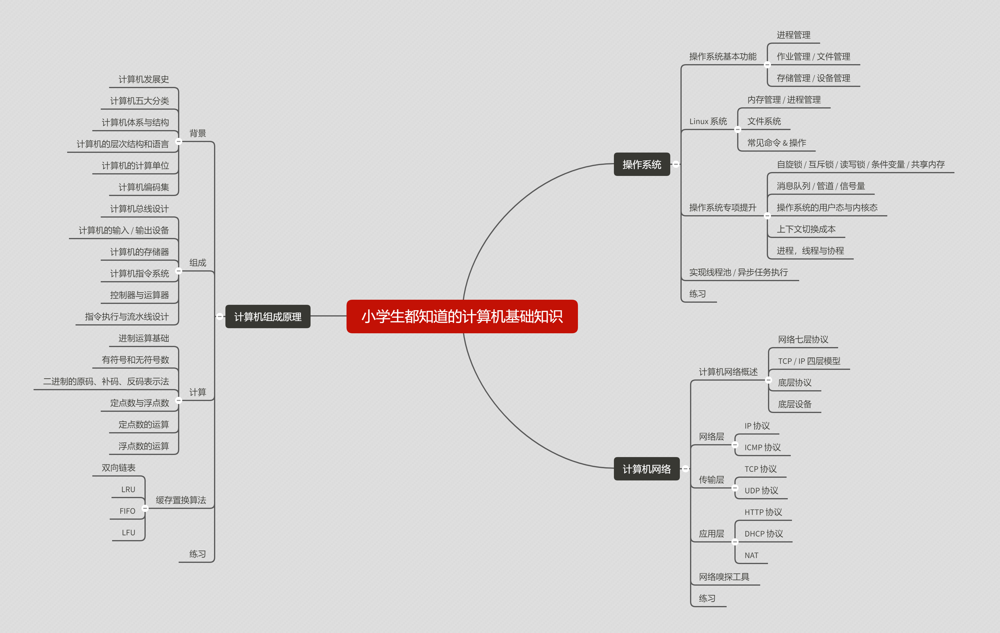

## 小学生都知道的计算机基础知识

````

呕心沥血造出来的电子版，转载请注明出处~

````

> 都 0202 年了
> 
> ~~你还不知道自己跟 『科班生』 差在哪吗？（手动滑稽）~~
> 
> 『小学生』都知道的东西，你忍心一无所知吗？
> 
> 收下这个 『小学生都知道的计算机基础知识』 宝典，从此，你还会害怕什么？
> 
> 看完之后，我期待完全体的你的到来

## 内容导图（果然加载不出来...）

<div align="center">
    
</div>

## 注意事项
* 之前必要时我每个知识点都会附上简单粗暴的示意图，想把这个笔记弄得尽可能全面
* 但是，GitHub 对图片的展示是在是太佛系了，后面发现这个问题之后，能用符号解释清的我尽量解释，其余的大佬们自行 Google

## 万众期待的正片部分

[正片开演](CATALOG.md)

## 反馈

[交流 & 吐槽]()
 
[错误反馈]()